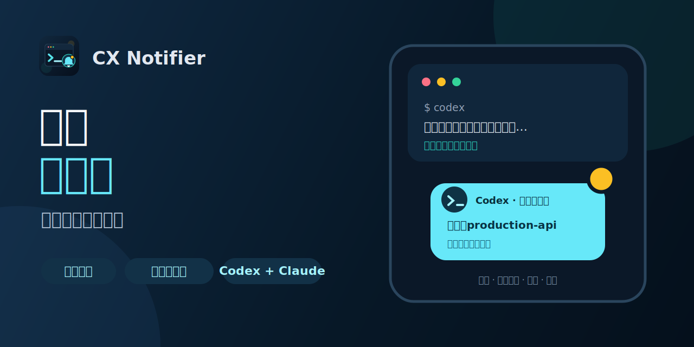

# CX Notifier — 牛马呼叫器

<p align="center">
  
</p>

**让 Agent 先干，轮到牛马再回来。** 把任务扔给 Codex 或 Claude Code，然后该摸鱼摸鱼。它要审批、跑完当前回复时，牛马呼叫器会通过飞书、企业微信、钉钉、macOS/Linux 桌面或 HTTPS Webhook 喊你回来。

- 不发送代码、diff、终端输出、工具参数或助手回复；
- 通知端不允许远程批准，操作仍须回到原会话完成；
- Codex 与 Claude Code 共用一套 Hook、渠道和路由配置。

## 30 秒体验

安装插件后，用一条命令启用无需机器人和密钥的桌面通知：

```bash
curl -fsSL https://raw.githubusercontent.com/GotoLu/cx-notifier-marketplace/main/scripts/setup_desktop.py | python3 -
```

适用于 macOS，或已安装 `notify-send` 的 Linux。脚本会创建 `desktop-main`、验证配置并触发一条测试通知。需要手机提醒时，再配置下方的飞书机器人。完整能力、隐私边界和故障排查见[插件说明](plugins/cx-plugin/README.md)。

## 平台安装

## Codex 安装

```bash
codex plugin marketplace add GotoLu/cx-notifier-marketplace
codex plugin add cx-plugin@cx-notifier
```

安装后请新建一个 Codex 任务，使 Hook 使用新安装的版本。

## Claude Code 安装

```bash
claude plugin marketplace add GotoLu/cx-notifier-marketplace
claude plugin install cx-plugin@cx-notifier
```

安装后运行 `/reload-plugins` 或新建 Claude Code 会话。具体配置见 [插件说明](plugins/cx-plugin/README.md)。

### Claude Code 自动更新（推荐）

第三方 marketplace 默认不自动更新。首次安装后只需开启一次官方自动更新：

1. 在 Claude Code 输入 `/plugin`；
2. 进入 `Marketplaces`；
3. 选择 `cx-notifier`；
4. 选择 `Enable auto-update`。

此后 Claude Code 会在启动后自动刷新 marketplace 并升级插件。后台检查可能随机延迟最多约 10 分钟；更新完成后按提示运行 `/reload-plugins`，或者在下一次启动时使用新版本。

### Claude Code 手动更新（故障排查）

尚未开启自动更新或需要立即升级时，复制下面这一条命令：

```bash
claude plugin marketplace update cx-notifier && claude plugin update cx-plugin@cx-notifier
```

命令成功后运行 `/reload-plugins`，或完全退出并重新启动 Claude Code。只有排查版本时才需要运行 `claude plugin details cx-plugin@cx-notifier`。`0.5.2` 应显示 `PermissionRequest`、`UserPromptSubmit` 和 `Stop`。其中 `UserPromptSubmit` 只在本地记录提问，不会单独发送通知；提问内容会随之后的 `Stop` 通知发送。0.5.2 还支持事件—项目—渠道路由、诊断命令、钉钉、桌面通知、HMAC 签名 Webhook，以及一键暂停和恢复推送。

## 飞书机器人快速配置

1. 在接收通知的飞书群中打开“群设置” → “群机器人” → “添加机器人” → “自定义机器人”。
2. 设置机器人名称并完成添加，复制飞书生成的 Webhook 地址。
3. 建议在机器人的安全设置中启用“签名校验”，并复制签名密钥。若不启用签名校验，后续配置时省略 `--secret-prompt`。
4. 确认已经通过上面的 Codex 或 Claude Code marketplace 命令安装插件，然后在终端执行一键配置：

   ```bash
   curl -fsSL https://raw.githubusercontent.com/GotoLu/cx-notifier-marketplace/main/scripts/setup_feishu.py | python3 -
   ```

   脚本会自动找到已安装插件，隐藏输入 Webhook 和签名密钥，验证配置并发送测试消息，无需克隆仓库。

5. 如果机器人没有启用签名校验，使用：

   ```bash
   curl -fsSL https://raw.githubusercontent.com/GotoLu/cx-notifier-marketplace/main/scripts/setup_feishu.py | python3 - --no-signature
   ```

命令不会在终端回显 Webhook 或密钥，配置默认保存在 `~/.config/cx-plugin/config.json` 并限制为当前用户可读写。需要每条通知都 `@所有人` 时，在命令末尾增加 `--mention-all`；重新配置已有渠道时增加 `--replace`。执行前可先查看 [`setup_feishu.py`](scripts/setup_feishu.py) 源码。完整说明和故障排查见[飞书机器人配置](plugins/cx-plugin/README.md#飞书机器人配置从零开始)。

## 仓库结构

```text
.agents/plugins/marketplace.json     # Codex marketplace
.claude-plugin/marketplace.json      # Claude Code marketplace
plugins/cx-plugin/                   # 两个平台共享的插件实现
  .codex-plugin/plugin.json          # Codex 元数据
  .claude-plugin/plugin.json         # Claude Code 元数据
  assets/                            # 商店图标、Logo 与功能预览
  hooks/                             # 共享 Hook 配置与 Python 入口
  scripts/                           # 本地配置工具
  tests/                             # 自动化测试
scripts/check_public_release.py      # 发布隐私与结构检查
scripts/setup_desktop.py             # 零密钥桌面通知快速配置
```

## 发布前检查

```bash
python3 scripts/check_public_release.py
python3 -B -m unittest discover -s tests -v
python3 -m unittest discover -s plugins/cx-plugin/tests -v
```

隐私检查会拒绝本地配置、缓存、数据库、日志、私钥、常见真实凭据形状、个人主目录和非示例 URL，并校验两套 marketplace 与插件清单保持一致。测试中用于验证脱敏的固定假凭据有精确白名单，不会放宽其他文件的检查。

## 隐私边界

- 仓库只包含 `config.example.json`，不包含实际 `config.json`。
- Webhook、签名密钥和 Bearer Token 应通过环境变量或用户本机的 `0600` 配置文件提供。
- 插件不会上传 transcript、原始工具输入、shell 命令、diff 或终端输出。
- 任务结束通知只附带本回合用户提问的脱敏摘要（最长 160 字），不发送助手回复。

[隐私政策](PRIVACY.md) · [使用条款](TERMS.md) · [支持](SUPPORT.md) · [安全报告](SECURITY.md) · [MIT License](LICENSE)
