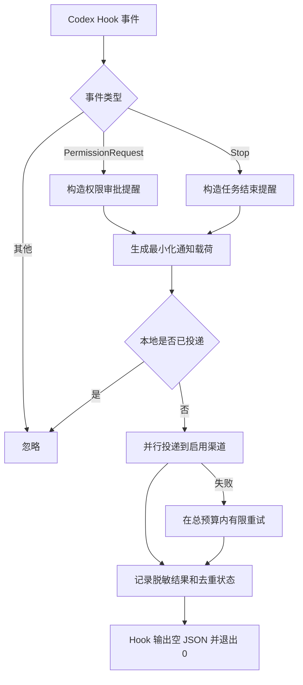

# Codex Notifier

`cx-plugin` 只处理两种 Codex 原生 Hook 事件，并向飞书、企业微信群机器人或通用 HTTPS Webhook 发送单向提醒：

- `PermissionRequest`：Codex 有操作等待用户审批；
- `Stop`：Codex 本次回复已经结束。

插件不解析助手回复中的关键词，不使用“红线操作”或自定义 marker，也不接入 Server 酱或个人微信。通知端不允许远程批准，任何批准或拒绝仍必须回到 Codex 完成。

## 行为边界

`PermissionRequest` 是 Codex 的原生权限事件。只有当前审批策略确实要求用户确认时，Codex 才会触发它。

`Stop` 是 Codex 的原生回复结束事件。插件对每个 `Stop` 都发送“Codex 任务已结束”，并附上经过长度限制和脱敏的本次任务简介。插件不判断任务是否在业务语义上真正完成。因此，助手完成任务、回答问题或结束回复等待你继续输入时，都会收到结束提醒。

插件忽略其他 Hook 事件。相同会话、相同回合和相同事件的重试会被去重；不同回合分别通知。

## 工作流程



网络失败采用 fail-open：通知器记录脱敏诊断后仍输出 `{}`、退出 `0`，不会阻断 Codex，也绝不会自动批准操作。

## 安装

先添加公开 marketplace，再安装插件：

```bash
codex plugin marketplace add GotoLu/cx-notifier-marketplace
codex plugin add cx-plugin@cx-notifier
```

安装或更新后需要：

1. 在 Codex 出现 Hook 信任提示时确认信任；
2. 启动一个新会话，让新版 Hook 生效。

## 配置

默认配置文件：

```text
~/.config/cx-plugin/config.json
```

也可设置 `CX_NOTIFY_CONFIG` 指向其他绝对路径。配置文件可能包含 Webhook 和签名密钥，必须保持 `0600` 权限。

推荐使用隐藏式输入配置飞书机器人：

```bash
python3 scripts/configure.py init
python3 scripts/configure.py add --type feishu --name feishu-main \
  --webhook-prompt --secret-prompt --mention-all
python3 scripts/configure.py validate
```

常用维护命令：

```bash
python3 scripts/configure.py list
python3 scripts/configure.py validate
python3 scripts/configure.py set-mention-all feishu-main on
python3 scripts/configure.py set-mention-all feishu-main off
python3 scripts/configure.py test --channel feishu-main
python3 scripts/configure.py remove feishu-main
```

`test` 会真实发送测试消息。飞书渠道启用 `mention_all=true` 后，所有消息最后一行都会追加唯一的：

```text
<at user_id="all">所有人</at>
```

若飞书群限制只有群主或管理员可以 `@所有人`，机器人也需要相应权限。

### 飞书配置示例

```json
{
  "name": "feishu-main",
  "type": "feishu",
  "enabled": true,
  "mention_all": true,
  "webhook_env": "CX_NOTIFY_FEISHU_WEBHOOK",
  "secret_env": "CX_NOTIFY_FEISHU_SECRET"
}
```

飞书签名密钥支持 `secret` 或 `secret_env`。机器人未启用签名校验时可以省略。插件同时校验 HTTP 状态和飞书业务响应码。

### 企业微信配置示例

```json
{
  "name": "wecom-main",
  "type": "wecom",
  "enabled": true,
  "webhook_env": "CX_NOTIFY_WECOM_WEBHOOK"
}
```

这里使用企业微信群机器人的官方 Webhook，不控制个人微信号，也不使用客户端注入。

### 通用 Webhook 配置示例

```json
{
  "name": "webhook-main",
  "type": "webhook",
  "enabled": true,
  "webhook_env": "CX_NOTIFY_WEBHOOK_URL",
  "bearer_token_env": "CX_NOTIFY_WEBHOOK_BEARER_TOKEN"
}
```

公网 Webhook 必须使用 HTTPS。仅当 `delivery.allow_insecure_localhost=true` 时，测试环境才允许 localhost HTTP。插件不跟随 HTTP 重定向。

## 隐私与安全

默认通知包含事件类型、通知 ID、时间、项目显示值、哈希后的会话/回合标识，以及权限事件的工具名称。任务结束通知还会发送从 Hook 结束消息提取、经过脱敏并限制为 200 字符的任务简介。

默认禁止外发：

- 完整用户提示、未经处理的助手消息和 transcript；
- 原始工具输入、shell 命令、diff、源码和终端输出；
- 绝对工作目录、用户名和环境变量；
- Webhook URL、签名密钥、Bearer Token 或认证头。

`privacy.include_permission_description` 默认是 `false`。显式开启后只发送经过长度限制和脱敏的权限说明，但仍建议高敏项目保持关闭。

去重状态和脱敏日志优先写入 `CX_NOTIFY_DATA`，其次写入 `PLUGIN_DATA`；两者均未设置时使用配置目录旁的 `data/`。状态不会写入任务项目仓库。

安全边界：

- 通知中没有批准链接；
- Hook 不返回 `allow`、`deny` 或阻塞决定；
- 飞书、企业微信和 Webhook 不能反向控制 Codex；
- 通知送达状态不能作为 Codex 继续执行的授权；
- Server 酱、个人微信机器人和远程批准不在范围内。

## 验收标准

| ID | 场景 | 通过条件 |
|---|---|---|
| PR-01 | 原生 `PermissionRequest` | 发送一次权限审批提醒，Codex 原审批界面保持可用 |
| ST-01 | 任意 `Stop` | 发送一次“Codex 任务已结束”提醒，并在有结束消息时附带任务简介 |
| ST-02 | `Stop` 正文含路径、凭据或超长内容 | 任务简介经过路径/凭据脱敏和长度限制 |
| EV-01 | 其他 Hook 事件 | 不发送通知 |
| DD-01 | 同一事件重试 | 只产生一个逻辑通知 |
| DD-02 | 不同回合的 `Stop` | 每个回合分别通知 |
| HTTP-01 | 2xx 与平台业务成功码 | 判定投递成功 |
| HTTP-02 | 408、429、5xx | 在预算内最多重试一次并复用通知 ID |
| HTTP-03 | 重定向或慢响应 | 不跟随重定向；Hook 在硬截止前退出 |
| SEC-01 | 配置、载荷和日志 | 不泄露 URL、令牌、原始命令或未经处理的助手消息 |

运行自动化验收：

```bash
python3 scripts/configure.py validate
python3 -m unittest discover -s tests -v
```

真实冒烟测试应在新 Codex 会话中分别触发一次权限审批和一次普通回复结束，确认两类飞书消息都能收到且 Codex 原流程不受影响。

## 排查

配置测试成功但实际 Hook 没有通知时，依次确认：

1. `codex plugin list` 中 `cx-plugin@personal` 是 `installed, enabled`；
2. 新会话已经启动；
3. Codex 中已经信任 `PermissionRequest` 和 `Stop` Hooks；
4. `python3 scripts/configure.py validate` 通过；
5. 权限测试确实触发了原生 `PermissionRequest`，而不是助手仅用文字询问。
