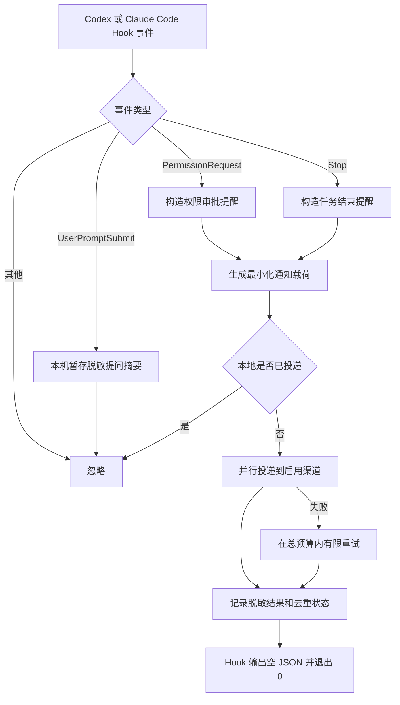

# Codex / Claude Code Notifier

`cx-plugin` 同时支持 Codex 和 Claude Code，处理三种原生 Hook 事件，并将单向提醒路由到飞书、企业微信、钉钉、桌面通知、通用 HTTPS Webhook 或 HMAC 签名 Webhook：

- `PermissionRequest`：编码代理有操作等待用户审批；
- `UserPromptSubmit`：只在本机暂存本回合用户提问的脱敏摘要，不发送通知；
- `Stop`：编码代理本次回复已经结束。

插件不解析助手回复中的关键词，不使用“红线操作”或自定义 marker，也不接入 Server 酱或个人微信。通知端不允许远程批准，任何批准或拒绝仍必须回到对应的 Codex 或 Claude Code 会话完成。

## 行为边界

`PermissionRequest` 是 Codex 和 Claude Code 都支持的原生权限事件。只有当前审批策略确实要求用户确认时才会触发。

`UserPromptSubmit` 和 `Stop` 都是原生回合事件。插件在提问时只在插件数据目录暂存经过脱敏、最长 160 字的提问摘要；收到对应的 `Stop` 后发送“任务已结束”提醒并附上该摘要。通知不再读取或发送助手的结束回复。插件不判断任务是否在业务语义上真正完成。因此，助手完成任务、回答问题或结束回复等待你继续输入时，都会收到结束提醒。

找不到对应提问时，结束通知会省略“提问”一行，不会回退到助手回复。插件忽略其他 Hook 事件。相同会话、相同回合和相同事件的重试会被去重；不同回合分别通知。

## 工作流程



网络失败采用 fail-open：通知器记录脱敏诊断后仍输出 `{}`、退出 `0`，不会阻断编码代理，也绝不会自动批准操作。

## Codex 安装

先添加公开 marketplace，再安装插件：

```bash
codex plugin marketplace add GotoLu/cx-notifier-marketplace
codex plugin add cx-plugin@cx-notifier
```

安装或更新后需要：

1. 在 Codex 出现 Hook 信任提示时确认信任；
2. 启动一个新会话，让新版 Hook 生效。

## Claude Code 安装

先添加公开 marketplace，再安装插件：

```bash
claude plugin marketplace add GotoLu/cx-notifier-marketplace
claude plugin install cx-plugin@cx-notifier
```

Claude Code 和 Codex 会从同一个 `hooks/hooks.json` 注册 `PermissionRequest`、`UserPromptSubmit` 和 `Stop`。Hook 命令会优先使用 Claude Code 的 `CLAUDE_PLUGIN_ROOT`，否则回退到 Codex 的 `PLUGIN_ROOT`，安装到任一插件缓存后都能正确定位入口。

安装或更新后运行 `/reload-plugins`，或启动新会话；再通过 `/hooks` 确认三类 Hook 已注册。

### Claude Code 开启自动更新（推荐）

第三方 marketplace 默认关闭自动更新。每位用户首次安装后只需开启一次：

1. 在 Claude Code 输入 `/plugin`；
2. 进入 `Marketplaces`；
3. 选择 `cx-notifier`；
4. 选择 `Enable auto-update`。

开启后，Claude Code 会在每次启动后于后台刷新 marketplace，并将已安装的插件升级到最新版。检查会随机延迟最多约 10 分钟，当前运行中的会话仍使用启动时加载的版本；看到更新提示后运行 `/reload-plugins` 即可应用，也可以等下一次启动自动生效。

如果设置了 `DISABLE_AUTOUPDATER`，Claude Code 会同时关闭插件自动更新。希望只关闭 Claude Code 自身更新、保留插件自动更新时，可同时设置 `FORCE_AUTOUPDATE_PLUGINS=1`。

### Claude Code 手动更新（故障排查）

尚未开启自动更新、需要立即升级或后台更新失败时，复制这一条命令，它会依次刷新 marketplace 并升级插件：

```bash
claude plugin marketplace update cx-notifier && claude plugin update cx-plugin@cx-notifier
```

更新命令提示成功后，运行 `/reload-plugins`，或完全退出并重新启动 Claude Code。

只有排查版本时才需要运行：

```bash
claude plugin details cx-plugin@cx-notifier
```

`0.3.0` 应显示三个 Hooks：`PermissionRequest`、`UserPromptSubmit`、`Stop`。`UserPromptSubmit` 不会单独发送飞书消息，它只在本地记录提问；对应的 `Stop` 通知会显示“提问：…”。如果仍显示 `0.2.0`，说明 marketplace 尚未刷新。

## 飞书机器人配置（从零开始）

### 1. 在飞书群中创建自定义机器人

在用于接收通知的飞书群中依次操作：

1. 打开群设置；
2. 进入“群机器人”；
3. 点击“添加机器人”；
4. 选择“自定义机器人”；
5. 填写机器人名称和描述并完成添加；
6. 复制飞书生成的 Webhook 地址并妥善保存。

本插件使用的是“群自定义机器人”，不是飞书开放平台中的应用机器人。一个自定义机器人只向它所在的群发送消息。

### 2. 配置安全校验

建议在机器人的安全设置中启用“签名校验”，然后复制飞书生成的签名密钥。插件会根据该密钥为每次请求生成签名。

- 启用了签名校验：配置时同时提供 Webhook 和签名密钥；
- 未启用签名校验：只提供 Webhook，省略下文的 `--secret-prompt`；
- 不建议把真实 Webhook 或签名密钥提交到项目仓库；
- 如果使用飞书关键词校验，关键词必须能匹配通知正文，例如 `项目`；
- IP 白名单需要填写运行 Codex 或 Claude Code 机器的公网出口 IP，动态网络环境不建议使用。

### 3. 一键配置（推荐）

确认已经通过 Codex 或 Claude Code marketplace 安装插件，然后在终端执行：

```bash
curl -fsSL https://raw.githubusercontent.com/GotoLu/cx-notifier-marketplace/main/scripts/setup_feishu.py | python3 -
```

一键脚本只负责定位本机已安装的插件，并调用插件自带的安全配置器。Webhook 和签名密钥由配置器通过终端隐藏输入，不会作为命令行参数传递，也不会发送到 GitHub。

脚本默认行为：

1. 自动查找 Codex 或 Claude Code 安装的 `cx-plugin`；
2. 创建 `~/.config/cx-plugin/config.json`；
3. 隐藏输入 Webhook 和签名密钥；
4. 添加并验证 `feishu-main`；
5. 向飞书群发送一条测试消息。

常用选项：

```bash
# 机器人未启用签名校验
curl -fsSL https://raw.githubusercontent.com/GotoLu/cx-notifier-marketplace/main/scripts/setup_feishu.py | python3 - --no-signature

# 每条通知 @所有人
curl -fsSL https://raw.githubusercontent.com/GotoLu/cx-notifier-marketplace/main/scripts/setup_feishu.py | python3 - --mention-all

# 替换已有 feishu-main 配置
curl -fsSL https://raw.githubusercontent.com/GotoLu/cx-notifier-marketplace/main/scripts/setup_feishu.py | python3 - --replace
```

执行从网络下载的脚本前，可先在仓库中查看 `scripts/setup_feishu.py` 源码。

### 4. 手动配置（可选）

不希望使用一键脚本时，可克隆公开仓库：

```bash
git clone https://github.com/GotoLu/cx-notifier-marketplace.git
cd cx-notifier-marketplace/plugins/cx-plugin
python3 scripts/configure.py init
python3 scripts/configure.py add --type feishu --name feishu-main \
  --webhook-prompt --secret-prompt
```

未启用签名校验时省略 `--secret-prompt`。如果希望每条消息都 `@所有人`，增加 `--mention-all`。飞书群可能限制只有群主或管理员可以 `@所有人`，机器人也需要相应权限。

### 5. 验证并发送测试消息

```bash
python3 scripts/configure.py validate
python3 scripts/configure.py list
python3 scripts/configure.py test --channel feishu-main
```

通过条件：

- `validate` 显示配置有效；
- `list` 能看到已启用的 `feishu-main`，但不会显示真实 Webhook 或密钥；
- 飞书群收到“配置测试”消息。

测试成功后，重新加载插件：Claude Code 运行 `/reload-plugins`，Codex 新建一个任务。随后分别触发一次权限请求或完成一次普通回复，确认能收到真实通知。

### 6. 配置文件位置

默认配置文件：

```text
~/.config/cx-plugin/config.json
```

也可设置 `CX_NOTIFY_CONFIG` 指向其他绝对路径。配置文件可能包含 Webhook 和签名密钥，必须保持 `0600` 权限。

常用维护命令：

```bash
python3 scripts/configure.py list
python3 scripts/configure.py validate
python3 scripts/configure.py set-mention-all feishu-main on
python3 scripts/configure.py set-mention-all feishu-main off
python3 scripts/configure.py test --channel feishu-main
python3 scripts/configure.py doctor
python3 scripts/configure.py simulate --event permission_request --project production-api
python3 scripts/configure.py status
python3 scripts/pause.py
python3 scripts/pause.py --status
python3 scripts/pause.py --resume
python3 scripts/configure.py remove feishu-main
```

`test` 会真实发送测试消息；`doctor` 检查配置和运行环境；`simulate` 只预览脱敏事件、规则命中的渠道和载荷，绝不发送；`status` 汇总本地脱敏日志。`pause.py` 默认暂停全部推送，`--resume` 恢复，且不会改变任何渠道原有的 `enabled` 状态。飞书渠道启用 `mention_all=true` 后，所有消息最后一行都会追加唯一的：

```text
<at user_id="all">所有人</at>
```

若飞书群限制只有群主或管理员可以 `@所有人`，机器人也需要相应权限。

### 规则路由

未配置 `rules` 时保持兼容行为：每个事件发送到所有启用渠道。配置规则后，插件合并所有匹配规则中的渠道；没有规则匹配时不发送。`events`、`projects` 和 `clients` 支持 `*` 通配符：

```json
{
  "rules": [
    {
      "name": "production-permissions",
      "events": ["permission_request"],
      "projects": ["production-*"],
      "clients": ["codex", "claude_code"],
      "channels": ["feishu-main", "desktop-main"]
    }
  ]
}
```

### 飞书配置示例

```json
{
  "name": "feishu-main",
  "type": "feishu",
  "enabled": true,
  "mention_all": true,
  "webhook_env": "CX_NOTIFY_FEISHU_WEBHOOK",
  "secret_env": "CX_NOTIFY_FEISHU_SECRET"
}
```

飞书签名密钥支持 `secret` 或 `secret_env`。机器人未启用签名校验时可以省略。插件同时校验 HTTP 状态和飞书业务响应码。

### 企业微信配置示例

```json
{
  "name": "wecom-main",
  "type": "wecom",
  "enabled": true,
  "webhook_env": "CX_NOTIFY_WECOM_WEBHOOK"
}
```

这里使用企业微信群机器人的官方 Webhook，不控制个人微信号，也不使用客户端注入。

### 通用 Webhook 配置示例

```json
{
  "name": "webhook-main",
  "type": "webhook",
  "enabled": true,
  "webhook_env": "CX_NOTIFY_WEBHOOK_URL",
  "bearer_token_env": "CX_NOTIFY_WEBHOOK_BEARER_TOKEN"
}
```

公网 Webhook 必须使用 HTTPS。仅当 `delivery.allow_insecure_localhost=true` 时，测试环境才允许 localhost HTTP。插件不跟随 HTTP 重定向。

### 钉钉、桌面和 HMAC Webhook

钉钉使用官方群机器人地址并可选签名密钥；桌面渠道不需要 Webhook，在 macOS 使用 `osascript`，Linux 使用 `notify-send`；HMAC 渠道使用 `HMAC-SHA256(secret, timestamp + "." + exact_body)`，默认写入 `X-CX-Timestamp` 和 `X-CX-Signature`：

```json
{
  "channels": [
    {"name": "dingtalk-main", "type": "dingtalk", "webhook_env": "CX_NOTIFY_DINGTALK_WEBHOOK", "secret_env": "CX_NOTIFY_DINGTALK_SECRET"},
    {"name": "desktop-main", "type": "desktop"},
    {"name": "signed", "type": "hmac", "webhook_env": "CX_NOTIFY_HMAC_WEBHOOK", "secret_env": "CX_NOTIFY_HMAC_SECRET"}
  ]
}
```

Provider 通过统一适配器注册；飞书、企业微信和钉钉继续固定官方域名，通用与 HMAC Webhook 要求 HTTPS。

## 隐私与安全

默认通知包含事件类型、通知 ID、时间、项目显示值、哈希后的会话/回合标识，以及权限事件的工具名称。任务结束通知还会发送从本回合 `UserPromptSubmit` 获取、经过脱敏并限制为 160 字符的提问摘要，不读取 `Stop` 中的助手回复。

默认禁止外发：

- 完整用户提示、助手消息和 transcript；
- 原始工具输入、shell 命令、diff、源码和终端输出；
- 绝对工作目录、用户名和环境变量；
- Webhook URL、签名密钥、Bearer Token 或认证头。

`privacy.include_permission_description` 默认是 `false`。显式开启后只发送经过长度限制和脱敏的权限说明，但仍建议高敏项目保持关闭。

去重状态、最长 160 字的脱敏提问摘要和脱敏日志优先写入 `CX_NOTIFY_DATA`，其次写入 Claude Code 的 `CLAUDE_PLUGIN_DATA` 或 Codex 的 `PLUGIN_DATA`；均未设置时使用配置目录旁的 `data/`。提问摘要不会保存原文，最多保留 24 小时，并会被同一回合或会话的下一次提问覆盖。状态不会写入任务项目仓库。

安全边界：

- 通知中没有批准链接；
- Hook 不返回 `allow`、`deny` 或阻塞决定；
- 飞书、企业微信和 Webhook 不能反向控制 Codex 或 Claude Code；
- 通知送达状态不能作为编码代理继续执行的授权；
- Server 酱、个人微信机器人和远程批准不在范围内。

## 验收标准

| ID | 场景 | 通过条件 |
|---|---|---|
| PR-01 | 原生 `PermissionRequest` | 发送一次权限审批提醒，Codex 原审批界面保持可用 |
| QS-01 | `UserPromptSubmit` | 不外发通知，只在插件数据目录保存脱敏、限长的提问摘要 |
| ST-01 | 对应提问后的任意 `Stop` | 发送一次“任务已结束”提醒，并附带本回合提问摘要 |
| ST-02 | 提问含路径、凭据或超长内容 | 提问摘要经过路径/凭据脱敏并限制为 160 字符 |
| ST-03 | `Stop` 没有对应提问 | 仍发送结束提醒，但不发送助手回复或提问摘要 |
| EV-01 | 其他 Hook 事件 | 不发送通知 |
| DD-01 | 同一事件重试 | 只产生一个逻辑通知 |
| DD-02 | 不同回合的 `Stop` | 每个回合分别通知 |
| HTTP-01 | 2xx 与平台业务成功码 | 判定投递成功 |
| HTTP-02 | 408、429、5xx | 在预算内最多重试一次并复用通知 ID |
| HTTP-03 | 重定向或慢响应 | 不跟随重定向；Hook 在硬截止前退出 |
| SEC-01 | 配置、载荷和日志 | 不泄露 URL、令牌、原始命令、完整提问或助手消息 |

运行自动化验收：

```bash
python3 scripts/configure.py validate
python3 -m unittest discover -s tests -v
```

真实冒烟测试应分别在新的 Codex 和 Claude Code 会话中触发一次权限审批和一次普通回复结束，确认消息来源显示正确，且原审批流程不受影响。

## 排查

配置测试成功但实际 Hook 没有通知时，依次确认：

1. `codex plugin list` 中 `cx-plugin@personal` 是 `installed, enabled`；
2. 新会话已经启动；
3. Codex 中已经信任 `PermissionRequest`、`UserPromptSubmit` 和 `Stop` Hooks；
4. `python3 scripts/configure.py validate` 通过；
5. 权限测试确实触发了原生 `PermissionRequest`，而不是助手仅用文字询问。

Claude Code 还需确认：

1. `cx-plugin@cx-notifier` 已安装并启用；
2. `/hooks` 中能看到来自 `cx-plugin` 的 `PermissionRequest`、`UserPromptSubmit` 和 `Stop`；
3. `python3` 在 Claude Code 运行环境的 `PATH` 中可用；
4. 必要时运行 `claude --debug` 查看 Hook 加载诊断。
